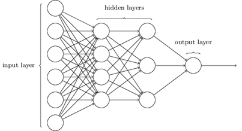
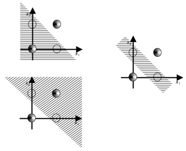

# DCVRP Solved With Genetic Algorithm
## Table of contents
- [Intorduction](#introduction)
    - [Rosenblatt  Perceptron](#rosenblatt-perceptron)
    - [XOR Problem](#xor-problem)
- [Code](#code)
    - [mlp_standard.py](#standard)
    - [mlp_momentum.py](#momentum)
    - [mlp_adam.py](#adam)
    - [mlp_mini_batch.py](#batch)
- [Comparative Analysis](#comparative-analysis)
- [License](#license)

## Introduction
### Rosenblatt Perceptron
The concept of the perceptron was introduced by Frank Rosenblatt in 1957. Together with Charles Wightman, Rosenblatt constructed a partially electromechanical, partially electronic device known as the perceptron, which was designed to recognize alphanumeric characters. Currently, the concept of the perceptron is used to refer to simple neural networks consisting of one or multiple independent McCulloch-Pitts neurons.

The perceptron illustrated in above figure, referred to as a binary perceptron, allows the classification of input parameters into one of two classes. 

The above figure depicts the architecture of a multilayer perceptron with two hidden layers. The introduction of additional layers enables the creation of new data representations, which are subsequently analyzed by successive layers.

### XOR Problem
The XOR, exclusive or is a logical operator whose negation is the logical biconditional. With two inputs, XOR is true if and only if the inputs differ (one is true, one is false). The below  truth table of shows that it outputs true whenever the inputs differ:

|X1|X2|Y|
|-----------|-----------|-----------|
|0         |0      |0          |
|0          |1      |1          |
|1          |0      |1          |
|1          |1      |0          |

In the case of the XOR problem, where the data is logically disjoint, the [simple perceptron](#perceptron) is unable to effectively classify input data into one of two classes using a single straight decision boundary. A comparison between the linearly separable problem (AND) and XOR is depicted in below figure.

To implement the XOR operation, it is necessary to combine two perceptrons, thus creating a two-layer neural network, as shown in below figure.

The additional layer enables further division of the space by hyperplanes, as illustrated in the below figure.

The above figure shows attempts to divide the linearly inseparable XOR problem using a straight line (left side) and after introducing an additional layer into the network (right side). It can be observed that the additional perceptron enables the delineation of decision boundaries encompassing points corresponding to logical 1 or 0, confirming the potential for correct classification.

## Code

<h3 id="standard">mlp_standard.py</h3>

The *[mlp_standard.py](https://github.com/jkskw/XOR_Perceptron/blob/main/src/mlp_standrad.py)* file contains the implementation of a multilayer perceptron (MLP) using a standard approach, which includes a specified number of input and output neurons, hidden layers, and training epochs. This MLP utilizes a sigmoid activation function and gradient descent with backpropagation to update the weights and biases iteratively, aiming to minimize the mean squared error (MSE) between the predicted and actual outputs during training.

<h3 id="momentum">mlp_momentum.py</h3>

The *[mlp_momentum.py](https://github.com/jkskw/XOR_Perceptron/blob/main/src/mlp_momentum.py)* file extends the implementation of the multilayer perceptron (MLP) to incorporate momentum-based gradient descent, enhancing the convergence speed and stability during training.

<h3 id="adam">mlp_adam.py</h3>

The *[mlp_adam.py](https://github.com/jkskw/XOR_Perceptron/blob/main/src/mlp_adam.py)* file implements a multilayer perceptron (MLP) using the Adam optimization algorithm for training. Adam optimization algorithm adapts the learning rate for each parameter based on the past gradients and squared gradients, along with bias correction terms.

<h3 id="batch">mlp_mini_batch.py</h3>

The *[mlp_mini_batch.py](https://github.com/jkskw/XOR_Perceptron/blob/main/src/mlp_mini_batch.py)* file implements a multilayer perceptron (MLP) with mini-batch gradient descent and momentum. Instead of updating weights and biases after processing the entire dataset (batch gradient descent), this implementation updates them after processing mini-batches of data.

## Comparative Analysis
This section presents a comparative analysis of multilayer perceptron (MLP), focusing on the impact of key factors such as the number of neurons, learning rates, momentum values, and different training methods.

The above figure shows a graphical representation of the XOR logic function, along with marked decision boundaries of the trained network. It can be seen that the use of two neurons in the hidden layer makes it possible to divide the space into hyperplanes appropriately classifying individual points (true - green or false - red).

The above figure presents the decision boundaries of the trained network with 3 neurons in the hidden layer. It can be observed that by increasing the number of neurons, the shape of the hyperplanes changes, however, the correctness of classification with greater or lesser error remains the same. It is important to note that increasing the number of neurons in the hidden layer leads to a loss of generalization capabilities in the neural network, while gaining memorization abilities, resulting in the model learning by rote, which is not desirable.

The above figure depicts the plot of mean squared error for the described [neural network configurations](#code). It can be observed that the most effective method for training the network is the Adaptive Moment Estimation algorithm, abbreviated as Adam. Adding the momentum coefficient is relatively simple, yet it significantly influences the minimization of mean squared error with respect to epoch changes.

The figure above presents a plot of the mean squared error as the learning rate value varies from 0.1 to 0.5. It can be observed that increasing the learning rate positively impacts the network's learning speed. The learning rate is a parameter that controls the extent to which the weights of the neural network are modified during the learning process, so increasing it proportionally affects the weight changes, leading to a faster convergence to an optimal solution. It is important to note that a too large learning rate may cause "overshooting" the minimum of the function and require reiteration in the next step, while a too small learning rate may fail to exploit the potential for minimizing the objective function value in the current step, also necessitating reiteration in the next step. An optimally chosen learning rate allows for rapid and stable reduction of the MSE value during the learning process.

Above figure depicts a plot of the mean squared error for momentum coefficient values ranging from 0.5 to 1. Increasing the momentum coefficient enables achieving an optimal solution in fewer steps because there is an increased tendency to continue moving in the same direction. Typically, the momentum coefficient value ranges from 0.9 to 0.99. However, with a too high momentum coefficient, there is a risk of overshooting, where the network may "jump over" the optimal solution or oscillate around the minimum, leading to instability in the learning process and an increase in MSE value.

## License
Distributed under the MIT License. See [`LICENSE`](/LICENSE) for more information.